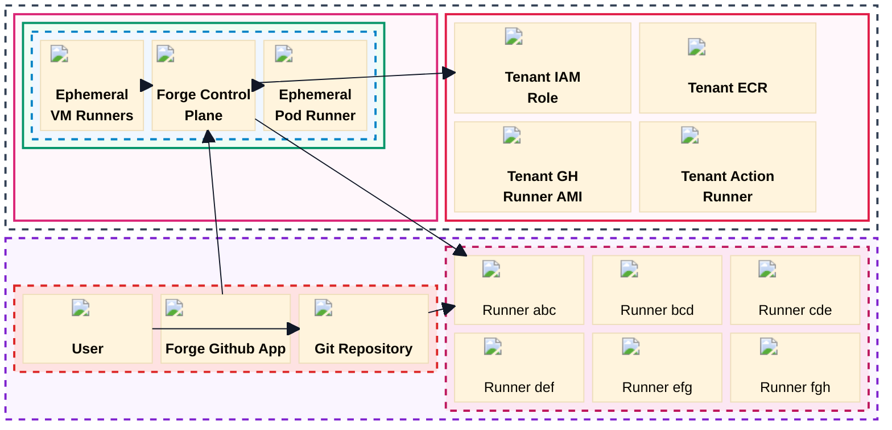

# 10k Foot Forge Overview

Source image: `../img/10k_ft.jpg`

## Textual Description

This diagram shows a single Forge tenant deployment. The AWS Cloud board
contains a Forge account and a tenant AWS account. Inside the Forge account, a
region contains one Forge instance for the tenant. That instance has a Forge
control plane that creates or coordinates ephemeral VM runners and ephemeral pod
runners.

The tenant AWS account contains the IAM role, ECR, tenant GitHub runner AMI,
and tenant action runner artifacts used by that tenant. The GitHub board shows
a tenant-managed repository, the Forge GitHub App, and a Forge GitHub runner
group. A user pushes code to the repository, the app is installed in the
repository, and workflows route jobs to the runner group.

## Mermaid Draft

## Evidence Used

- `README.md`: ForgeMT is an AWS GitHub Actions runner platform with secure
  multi-tenancy, ephemeral EC2 and Kubernetes runners, GitHub App management,
  and optional observability.
- `modules/platform/forge_runners/README.md`: The tenant stack composes EC2
  runners, ARC runners, GitHub App settings, runner group reconciliation,
  trust validation, log archival, and webhook relay.
- `modules/platform/forge_runners/roles.tf`: Forge runner policies include
  `sts:AssumeRole`, `sts:TagSession`, and ECR pull permissions.

## Review Notes

- The source image shows the Forge GitHub App connected into the repository and
  Forge control plane, but does not label the exact event type. The draft uses
  `Webhook app events`; review before publishing.
- Exact AWS/Miro-style icons are available in the rendered PNG through the
  local `aws-forge` icon pack. Raw GitHub Mermaid may need an icon fallback if
  the diagram is embedded directly instead of using the exported PNG.
- This draft uses Mermaid `block` layout so the AWS and GitHub boards stay in
  the same organization as the source image. Block links do not support normal
  edge labels, so relationship details are kept in the description.
