# Tenant AWS Account Detail

Source image: `../img/10k_ft_tenant.jpg`

## Textual Description

This diagram focuses on the identity and artifact relationships between a Forge
tenant instance and a tenant AWS account. In the Forge account, Forge Runner IAM
roles are attached to ephemeral pod runners by Pod Identity and to ephemeral VM
runners by instance profile. Those runner identities can assume the tenant IAM
role when the tenant role trusts them.

The tenant AWS account owns the tenant IAM role, tenant ECR, tenant GitHub
runner AMI, tenant action runner image, ECR policy, and downstream AWS
services. The tenant IAM role permits access to AWS services. The ECR policy
allows Forge runners to pull tenant ECR images. The tenant GitHub runner AMI is
shared with the Forge AWS account for EC2 runners.

## Mermaid Draft

```mermaid
%%{init: {"theme": "base", "architecture": {"iconSize": 52, "fontSize": 12, "nodeSeparation": 125, "idealEdgeLengthMultiplier": 3.0, "edgeElasticity": 0.22, "numIter": 7000, "seed": 11}, "themeVariables": {"fontFamily": "Inter, Arial, sans-serif", "fontSize": "12px", "darkMode": false, "background": "#ffffff", "mainBkg": "#ffffff", "secondaryColor": "#ffffff", "tertiaryColor": "#ffffff", "clusterBkg": "#ffffff", "labelBackground": "#ffffff", "primaryTextColor": "#111827", "primaryColor": "#fff7fb", "primaryBorderColor": "#be185d", "lineColor": "#1f2937", "archEdgeColor": "#1f2937", "archEdgeArrowColor": "#1f2937", "archEdgeWidth": "2.6", "archGroupBorderColor": "#be185d", "archGroupBorderWidth": "2px"}}}%%
architecture-beta
  group aws(aws-forge:aws-cloud-logo)[AWS Cloud]
  group forge(aws-forge:aws-account)[Forge Account] in aws
  group instance[Forge Instance per Tenant] in forge
  group region(aws-forge:region)[Region] in instance
  group tenant(aws-forge:aws-account)[Tenant AWS Account] in aws

  service forge_roles(aws-forge:iam-role)[Forge Runner IAM Roles] in instance
  service vm(aws-forge:ec2-instances)[Ephemeral VM Runners] in region
  service pod(aws-forge:pod)[Ephemeral Pod Runner] in region

  service tenant_iam(aws-forge:iam-role)[Tenant IAM Role] in tenant
  service aws_services(aws-forge:aws-services)[AWS Services] in tenant
  service tenant_ecr(aws-forge:ecr)[Tenant ECR] in tenant
  service tenant_ami(aws-forge:ami)[Tenant GH Runner AMI] in tenant
  service tenant_action(aws-forge:ecr)[Tenant Action Runner] in tenant
  service ecr_policy(aws-forge:ecr-policy)[ECR policy] in tenant

  forge_roles:B -[Pod Identity]-> T:pod
  forge_roles:B -[Instance Profile]-> T:vm
  forge_roles:R -[Trust Relationship to allow Forge Runner to assume Roles in Tenant Account]-> L:tenant_iam

  tenant_iam:R -[Allow to access AWS Services]-> L:aws_services
  vm:R -[Allow to pull run Tenant ECR on top of Forge Runner]-> L:tenant_ecr
  vm:R -[Share Tenant GH Runner AMI with Forge AWS Account]-> L:tenant_ami
  pod:R -[Allow to pull run Tenant Action Runner]-> L:tenant_action

  ecr_policy:L -[Allow Forge Runners to pull ECR]-> R:tenant_ecr
  ecr_policy:L -[Allow Forge Runners to pull ECR]-> R:tenant_action

  align column forge_roles vm pod
  align column tenant_iam tenant_ecr tenant_ami tenant_action
  align row forge_roles tenant_iam aws_services
  align row vm tenant_ecr ecr_policy
```

## Evidence Used

- `modules/platform/forge_runners/README.md`: Tenant config includes
  `iam_roles_to_assume` and `ecr_registries`, and the module manages policies
  that let runners assume tenant-approved roles and pull allowed ECR images.
- `modules/platform/forge_runners/roles.tf`: Forge runner policy grants
  `sts:AssumeRole`, `sts:TagSession`, and ECR pull actions.
- `modules/platform/arc/scale_set/README.md`: ARC scale sets manage the runner
  IAM role, Kubernetes service account, and EKS Pod Identity association.
- `modules/helpers/forge_subscription/README.md`: Tenant-side IAM role trust
  and ECR repository policies allow Forge runner principals to access tenant
  resources.

## Review Notes

- This Mermaid draft keeps the separate tenant IAM, ECR, AMI, action runner,
  ECR policy, AWS services, pod runner, and VM runner boxes from the source
  image.
- This draft uses Mermaid `architecture-beta` so AWS Cloud, Forge Account,
  Forge Instance, Region, and Tenant AWS Account labels are visible in the
  rendered diagram.
- Mermaid architecture edge labels use `-[Label]->` syntax and do not accept
  `/` or HTML line breaks, so source labels such as `pull/run` are represented
  as `pull run`.
- The image does not specify exact tenant AWS service names behind `AWS Services`; this draft keeps the generic label.
