# Full Forge Architecture

Source image: `../img/forge_architecture.jpg`

## Textual Description

This diagram combines the tenant runner platform, tenant AWS account, GitHub,
Splunk, and internal network views. The large `Managed by Forge Team` overlay
contains the Forge-operated AWS runner platform and the Forge-managed GitHub
runner group. The AWS Cloud board contains the Forge account, one Forge
instance per tenant/AWS region, the region-level EC2 and EKS runner components,
and the tenant AWS account boundary.

Inside the Forge account, the tenant instance includes Forge Runner IAM roles,
EC2 runner AMIs, Forge Ops ECRs, action runner images, the Forge EKS cluster,
ARC runner pods, Forge EKS nodes, EC2 ephemeral VM runners, webhook and warm
pool jobs, CloudWatch Logs, tenant pod controller, and API Gateway endpoint.
Those components map to the documented Forge runner stack, EC2 runner lane,
ARC/EKS runner lane, webhook relay, runner group registration, and job log
handling modules.

The tenant AWS account owns the tenant IAM role, tenant ECR, tenant GitHub
runner AMI, tenant action runner, ECR policy, and downstream AWS services.
GitHub contains the tenant-managed repository and the GitHub App installation,
plus GitHub internal processing and the Forge GitHub runner group. CloudWatch
logs feed Splunk Cloud / Splunk Observability, and runner workloads can access
an internal network where allowed by the environment.

## Mermaid Draft

```mermaid
%%{init: {"theme": "base", "securityLevel": "loose", "themeVariables": {"fontFamily": "Inter, Arial, sans-serif", "fontSize": "12px", "darkMode": false, "background": "#ffffff", "lineColor": "#111827", "primaryTextColor": "#111827"}}}%%
block
  columns 1

  block:FORGE_TEAM
    columns 1
    block:AWS
      columns 2
      block:FORGE_ACCOUNT
        columns 1
        block:INSTANCE
          columns 1
          block:REGION
            columns 4
            FORGE_AMI["<img src='http://127.0.0.1:8123/assets/ami.svg' width='50'/><br/>Forge GH<br/>Runner AMI"]
            FORGE_ROLES["<img src='http://127.0.0.1:8123/assets/iam-role.svg' width='54'/><br/>Forge Runner<br/>IAM Roles"]
            VM_RUNNERS["<img src='http://127.0.0.1:8123/assets/ec2-instances.svg' width='54'/><br/>Forge GH<br/>Ephemeral VM<br/>Runners"]
            WARM_POOL_JOB["<img src='http://127.0.0.1:8123/assets/lambda.svg' width='50'/><br/>Warm pool<br/>job"]
            FORGE_OPS_ECR["<img src='http://127.0.0.1:8123/assets/ecr.svg' width='50'/><br/>Forge Ops<br/>ECRs"]
            POD["<img src='http://127.0.0.1:8123/assets/pod.svg' width='54'/><br/>Pod"]
            EKS_NODES["<img src='http://127.0.0.1:8123/assets/ec2-instances.svg' width='54'/><br/>Forge EKS<br/>Nodes"]
            CLOUDWATCH["<img src='http://127.0.0.1:8123/assets/cloudwatch.svg' width='50'/><br/>Amazon<br/>CloudWatch<br/>Logs"]
            ACTION_RUNNER["<img src='http://127.0.0.1:8123/assets/ecr.svg' width='50'/><br/>Action Runner"]
            WEBHOOK_JOB["<img src='http://127.0.0.1:8123/assets/lambda.svg' width='50'/><br/>Webhook job"]
            TENANT_PODS_CONTROLLER["<img src='http://127.0.0.1:8123/assets/pod.svg' width='54'/><br/>Tenant Pods<br/>Controller"]
            API_GATEWAY["<img src='http://127.0.0.1:8123/assets/api-gateway.svg' width='50'/><br/>Amazon API<br/>Gateway<br/>Endpoint"]
            FORGE_EKS_CLUSTER["<img src='http://127.0.0.1:8123/assets/eks.svg' width='50'/><br/>Forge EKS<br/>Cluster"]
            space
            space
            space
          end
        end
      end

      block:TENANT_ACCOUNT
        columns 2
        TENANT_IAM["<img src='http://127.0.0.1:8123/assets/iam-role.svg' width='54'/><br/>Tenant IAM<br/>Role"]
        AWS_SERVICES["<img src='http://127.0.0.1:8123/assets/aws-services.svg' width='54'/><br/>AWS Services"]
        TENANT_ECR["<img src='http://127.0.0.1:8123/assets/ecr.svg' width='54'/><br/>Tenant ECR"]
        ECR_POLICY["<img src='http://127.0.0.1:8123/assets/ecr-policy.svg' width='54'/><br/>ECR policy"]
        TENANT_AMI["<img src='http://127.0.0.1:8123/assets/ami.svg' width='54'/><br/>Tenant GH<br/>Runner AMI"]
        TENANT_ACTION["<img src='http://127.0.0.1:8123/assets/ecr.svg' width='54'/><br/>Tenant Action<br/>Runner"]
      end
    end

    block:LOWER
      columns 3
      block:GITHUB
        columns 2
        block:GH_ADMIN
          columns 1
          GITHUB_APP["<img src='http://127.0.0.1:8123/assets/github-app.svg' width='58'/><br/>Forge Github App"]
        end
        block:TENANT_MANAGED
          columns 3
          USER["<img src='http://127.0.0.1:8123/assets/user-line.svg' width='52'/><br/>User"]
          REPO["<img src='http://127.0.0.1:8123/assets/git-repository-line.svg' width='56'/><br/>Git Repository"]
          GITHUB_INTERNAL["<img src='http://127.0.0.1:8123/assets/generic-line.svg' width='52'/><br/>Github Internal<br/>Processing"]
        end
        block:RUNNER_GROUP
          columns 3
          RUNNER_ABC["<img src='http://127.0.0.1:8123/assets/github-runner.svg' width='42'/><br/>Runner abc"]
          RUNNER_BCD["<img src='http://127.0.0.1:8123/assets/github-runner.svg' width='42'/><br/>Runner bcd"]
          RUNNER_CDE["<img src='http://127.0.0.1:8123/assets/github-runner.svg' width='42'/><br/>Runner cde"]
          RUNNER_DEF["<img src='http://127.0.0.1:8123/assets/github-runner.svg' width='42'/><br/>Runner def"]
          RUNNER_EFG["<img src='http://127.0.0.1:8123/assets/github-runner.svg' width='42'/><br/>Runner efg"]
          RUNNER_FGH["<img src='http://127.0.0.1:8123/assets/github-runner.svg' width='42'/><br/>Runner fgh"]
        end
      end

      block:SPLUNK
        columns 2
        SPLUNK_LOGS["<img src='http://127.0.0.1:8123/assets/logs-line.svg' width='46'/><br/>Logs"]
        SPLUNK_DASHBOARDS["<img src='http://127.0.0.1:8123/assets/generic-line.svg' width='46'/><br/>Dashboards"]
        SPLUNK_METRICS["<img src='http://127.0.0.1:8123/assets/metrics-line.svg' width='46'/><br/>Metrics"]
        space
      end

      block:INTERNAL
        columns 1
        GENERIC_APP["<img src='http://127.0.0.1:8123/assets/generic-line.svg' width='54'/><br/>Generic<br/>Application"]
      end
    end
  end

  FORGE_ROLES --> POD
  FORGE_ROLES --> VM_RUNNERS
  FORGE_ROLES --> TENANT_IAM
  TENANT_IAM --> AWS_SERVICES
  ECR_POLICY --> TENANT_ECR
  ECR_POLICY --> TENANT_ACTION
  FORGE_AMI --> VM_RUNNERS
  FORGE_OPS_ECR --> VM_RUNNERS
  FORGE_OPS_ECR --> EKS_NODES
  ACTION_RUNNER --> POD
  FORGE_EKS_CLUSTER --> EKS_NODES
  POD --> EKS_NODES
  TENANT_PODS_CONTROLLER --> EKS_NODES
  API_GATEWAY --> WEBHOOK_JOB
  WEBHOOK_JOB --> VM_RUNNERS
  WARM_POOL_JOB --> VM_RUNNERS
  VM_RUNNERS --> CLOUDWATCH
  WEBHOOK_JOB --> CLOUDWATCH
  WARM_POOL_JOB --> CLOUDWATCH
  CLOUDWATCH --> SPLUNK_LOGS
  TENANT_ECR --> VM_RUNNERS
  TENANT_AMI --> VM_RUNNERS
  TENANT_ACTION --> POD
  USER --> REPO
  REPO --> GITHUB_APP
  REPO --> GITHUB_INTERNAL
  GITHUB_INTERNAL --> GITHUB_APP
  REPO --> RUNNER_ABC
  REPO --> API_GATEWAY
  VM_RUNNERS --> RUNNER_ABC
  TENANT_PODS_CONTROLLER --> RUNNER_BCD
  CLOUDWATCH --> RUNNER_CDE
  VM_RUNNERS --> GENERIC_APP
  EKS_NODES --> GENERIC_APP

  style FORGE_TEAM fill:#ffffff,stroke:#ffffff
  style AWS fill:#ffffff,stroke:#334155,stroke-width:2px,stroke-dasharray:6 6
  style FORGE_ACCOUNT fill:#fff7fb,stroke:#db2777,stroke-width:2px
  style INSTANCE fill:#f0f7ff,stroke:#0284c7,stroke-width:2px,stroke-dasharray:6 6
  style REGION fill:#f0fdf4,stroke:#059669,stroke-width:2px
  style TENANT_ACCOUNT fill:#fff7fb,stroke:#e11d48,stroke-width:2px
  style LOWER fill:#ffffff,stroke:#ffffff
  style GITHUB fill:#faf5ff,stroke:#7e22ce,stroke-width:2px,stroke-dasharray:6 6
  style GH_ADMIN fill:#ffedd5,stroke:#ea580c,stroke-width:2px,stroke-dasharray:6 6
  style TENANT_MANAGED fill:#fee2e2,stroke:#dc2626,stroke-width:2px,stroke-dasharray:6 6
  style RUNNER_GROUP fill:#fce7f3,stroke:#be185d,stroke-width:2px,stroke-dasharray:6 6
  style SPLUNK fill:#fffbeb,stroke:#ca8a04,stroke-width:2px,stroke-dasharray:6 6
  style INTERNAL fill:#eef2ff,stroke:#4338ca,stroke-width:2px,stroke-dasharray:6 6

```

## Evidence Used

- `README.md`: ForgeMT is an AWS GitHub Actions runner platform with secure
  multi-tenancy, ephemeral EC2 and Kubernetes runners, automation for GitHub App
  management, and optional observability integrations.
- `docs/reference/module-layout.md`: `modules/platform/forge_runners` is the
  tenant runner entry point; `ec2_deployment` is the EC2 runner lane;
  `arc_deployment` and `arc` are the ARC/Kubernetes lane; `modules/infra/eks`
  is the foundation for ARC runners; Splunk modules are optional integrations.
- `docs/getting-started/configure-platform.md`: The normal platform entry
  point wires EC2 runner specs, ARC runner specs, GitHub App settings, tenant
  metadata, webhook handling, job logs, and IAM boundaries.
- `modules/platform/forge_runners/README.md`: The tenant stack composes EC2
  runners, ARC runners, GitHub App settings, runner group reconciliation, trust
  validation, log archival, webhook relay, and self-healing utilities.
- `modules/platform/ec2_deployment/README.md`: The EC2 lane uses the upstream
  `terraform-aws-github-runner` multi-runner module for webhook, scale-up,
  scale-down, ephemeral registration, AMI selection, warm pools, and logging.
- `modules/platform/arc/README.md` and
  `modules/platform/arc/scale_set/README.md`: The ARC lane creates ephemeral
  runner pods, tenant scale sets, Karpenter scheduling boundaries, runner IAM
  roles, Kubernetes service accounts, and EKS Pod Identity associations.
- `modules/infra/eks/README.md`: The EKS foundation provides Karpenter,
  Calico, EBS CSI, CoreDNS, and EKS Pod Identity add-ons.
- `modules/helpers/forge_subscription/README.md`: Tenant-side subscription
  access creates IAM role trust and ECR policy statements for Forge runner
  principals.

## Review Notes

- Needs review: the source image says `Tenant SL AWS Account`, while the
  smaller tenant diagrams say `Tenant AWS Account`.
- Needs review: the source image shows a `Register Runner` label near
  CloudWatch and GitHub runner group paths. The draft preserves the visible
  label as a CloudWatch-to-runner-group edge, but the exact source line may be
  an overlapping runner registration path rather than a CloudWatch behavior.
- Needs review: the `Access to Internal network` arrows are visible but do not
  specify which workload, route, or policy enables access. The draft keeps the
  generic arrows from EC2 runners and EKS nodes to the internal network.
- The full source image is too dense for `architecture-beta` without creating a
  sparse, unreadable canvas. This draft uses Mermaid `block` layout to preserve
  the major boards and component organization.
- Mermaid block links do not support normal edge labels. The diagram keeps the
  visible components and relationship arrows, while the textual description and
  review notes preserve the detailed relationship labels.
