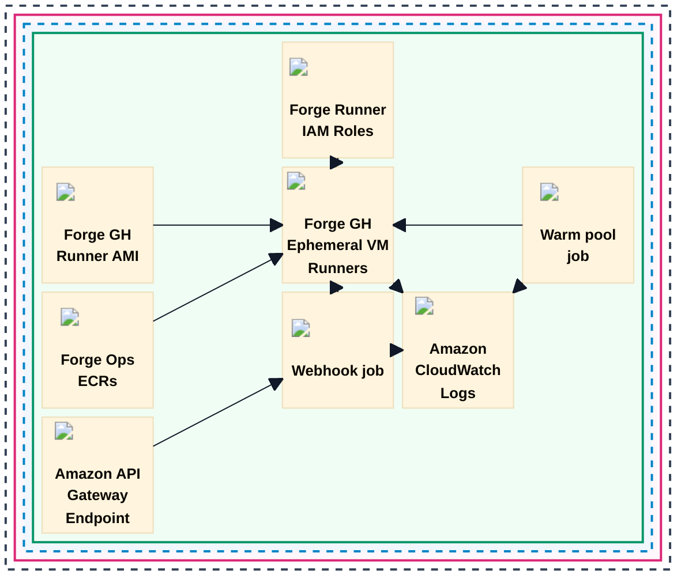

# Forge EC2 Runner Detail

Source image: `../img/forge_runner_ec2.jpg`

## Textual Description

This diagram shows the EC2 runner lane inside one Forge tenant instance. The
Forge account contains a region with Forge GitHub runner AMIs, Forge Ops ECRs,
the Forge GitHub ephemeral VM runners, the API Gateway endpoint, webhook job,
warm pool job, and CloudWatch Logs.

The Forge Runner IAM roles attach to EC2 runners by instance profile. The AMI
defines the VM image used by Forge runners, and Forge Ops ECRs provide images
that can run on top of Forge runners. The API Gateway endpoint triggers the
webhook job, the webhook job and warm pool job can spin VM runners, and runner
plus Lambda execution logs flow into Amazon CloudWatch Logs.

## Mermaid Draft

## Evidence Used

- `modules/platform/ec2_deployment/README.md`: The EC2 lane uses the upstream
  `terraform-aws-github-runner` multi-runner module, handles webhook,
  scale-up, scale-down, ephemeral registration, label matching, AMI selection,
  warm pools, capacity type, tags, and logging hooks.
- `modules/platform/ec2_deployment/main.tf`: The module configures the
  upstream multi-runner module with GitHub App auth, EventBridge, logging,
  subnet IDs, KMS, and runner configuration.
- `modules/platform/forge_runners/ec2_runners.tf`: The umbrella tenant module
  passes tenant ECR registries, runner IAM policy ARNs, GitHub App values, and
  runner group name into `ec2_deployment`.

## Review Notes

- The source diagram uses generic labels `Webhook job` and `Warm pool job`
  rather than exact Lambda names. This draft keeps those labels.
- The source image shows both Lambda jobs sending execution logs to
  CloudWatch. It does not show EventBridge explicitly, even though the EC2
  module configures EventBridge, so EventBridge is intentionally omitted here.
- This draft uses Mermaid `block` layout so the EC2 runner board stays compact
  like the source image. Block links do not support normal edge labels, so
  relationship details are kept in the description.
