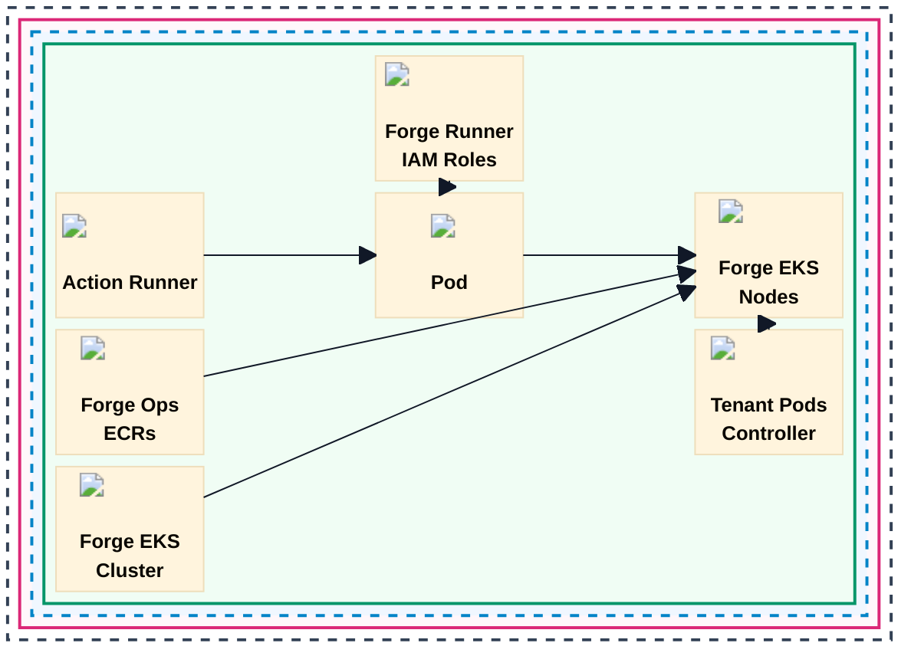

# Forge EKS Runner Detail

Source image: `../img/forge_runner_eks.jpg`

## Textual Description

This diagram shows the Kubernetes/ARC runner lane inside one Forge tenant
instance. The Forge account contains a region with action runner images, Forge
Ops ECRs, the Forge EKS cluster, the runner pod, Forge EKS nodes, and the
tenant pods controller.

Forge Runner IAM roles attach to runner pods through Pod Identity. Action
runner ECR images are used to run the pod in Forge Kubernetes. Forge Ops ECRs
can run as container jobs in Kubernetes runners. The EKS cluster provides EKS
nodes, and the tenant pods controller schedules tenant pods onto nodes.

## Mermaid Draft

## Evidence Used

- `modules/platform/arc/README.md`: The Kubernetes lane turns GitHub Actions
  jobs into ephemeral pods, installs ARC controller resources, creates scale
  sets, and applies Karpenter objects for tenant scheduling boundaries.
- `modules/platform/arc/scale_set/README.md`: A scale set creates one
  ephemeral runner pod per job and manages the runner IAM role, Kubernetes
  service account, EKS Pod Identity association, scale set labels, container
  images, resources, and volumes.
- `modules/infra/eks/README.md`: The EKS foundation provides the shared
  cluster for ARC runners, including Karpenter, Calico, EBS CSI, CoreDNS, and
  EKS Pod Identity add-ons.

## Review Notes

- The source image labels the central runtime simply as `Pod`. This draft does
  not expand it to `ARC runner pod` in the diagram label, but the description
  clarifies the documented ARC behavior.
- The image uses `K8S`; this draft keeps `K8S` only where it appears in edge
  labels and uses EKS/Kubernetes in descriptions.
- This draft uses Mermaid `block` layout so the EKS runner board stays compact
  like the source image. Block links do not support normal edge labels, so
  relationship details are kept in the description.
