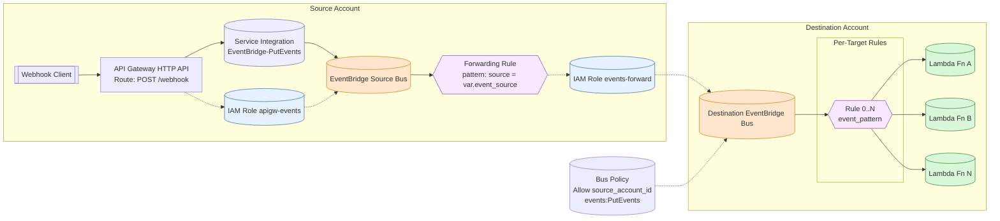

# Webhook Relay (Source & Destination)

Generic cross-account EventBridge webhook relay pattern (HTTP API -> EventBridge -> cross-account bus -> Lambda targets).

## Architecture

## End-to-End Flow

1. Client POST /webhook (JSON body)
2. API Gateway service integration calls EventBridge PutEvents (no Lambda)
3. Event lands on source bus with Source = var.event_source
4. Forwarding rule matches and uses its IAM role to PutEvents to destination bus
5. Destination bus policy authorizes source account (optionally narrowed by principal ARN)
6. Per-target rules match subsets (event_pattern) and invoke existing Lambdas

## Deployment Model

- Source module: exposes webhook endpoint + forwards to destination bus
- Destination module: creates bus, policy, N rules targeting existing Lambdas
- Add/remove targets by editing the targets list and reapplying
